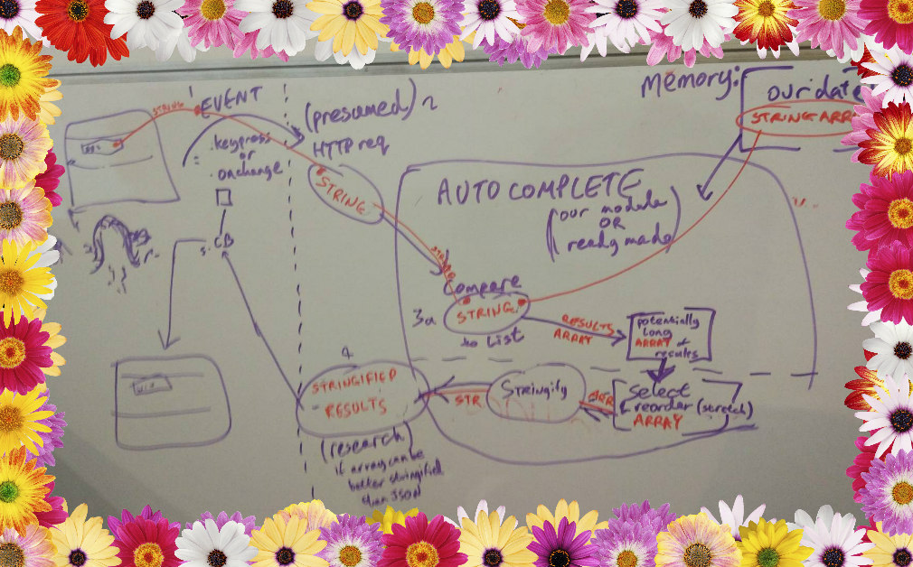

# TAAA - Auto Complete

## WHY (describing the purpose)
Star Light Primary School are doing a hip new age rendition of the Nativity Play with dinosaurs. In an attempt to be scientifically factual with the naming of dinosaurs, Ms Dimbles wanted to be able to quickly check and select dinosaur names with various starting letters.
## WHAT (describing your site)
### User Stories
Ms Dimbles wants:
> to be able to type letters and be displayed with names of dinosaurs matching the letters she has typed

> to be able to use a screen reader to fill out and read out the autocomplete suggestions

>to be informed if there is no dinosaur names starting with her typed letters

### Stretch Goals
- [ ] User is given suggestions which are selected according to some logic, rather than alphabetical
- [ ] Have a beautiful drop down menu rather than gross HTML defaults

## HOW (describing the journey to completion)

### Architecture
#### Drawing out our user experience

We mapped out how our website would be constructed including what data types our functions would be taking as arguments and returning.

#### Separation of Concerns

| Front End | Back End |
| -------- | -------- |
| DOM related files - *index.html, main.css, dom.js*    | Server - *server.js and handlers.js serving our files for hosting on Heroku*    |
| Front End Logic - *??We created this file incase we would need it, but we thought probably not??*  | Back End Logic - *We decided to search for the string on our server to limit size of the data being transfered between the client and the server*     |
|    | Data Set - *Our JSON of dinosaur names*     |

### Data Storage and Retrival
We saved our data in a JSON file on the server.

### Server Showdown
Our client page will expect a server to be able to provide updates for the menu, so out server will need some API-type functionality. We put thought into the most efficient

### API considerations

We put thought into the most efficient means of client/ server exchange of data over a given protocol, as a full API request and response will made after every keypress. We decided that arrays are a space-efficient means of storing the word data, and that the transmission overhead of an array in a JSON object could be minimised by storing the array as:

`transmissionObject = {
  var potentiallyLargeArray = ['str1','str2','strN']
  }`

We also considered various means other than HTTP requests for quickly exchanging client/ server data. 

### DOM Manipulation

### Useful Links

